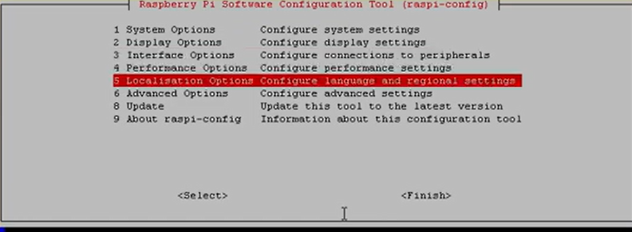
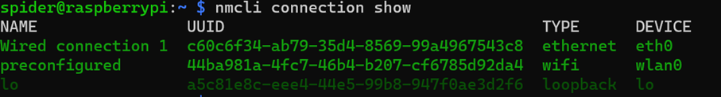

# SpiderNet

Un Logiciel/configuration pour permettre de créer un evil portal et de récupérer des informations sur un ordinateur cible.

[](https://choosealicense.com/licenses/mit/)


## Demo

Insert gif or link to demo

## Screenshots


## Déploiement

Pour déployer ce projet vous devez :

### Matériel requis :

- Raspberry Pi 4,
- Câble ethernet
- Carte Micro SD
- Adaptateur Micro SD to USB

### Logiciel requis :

- Raspap,
- Nodogslpash
- Raspberry Pi Imager

### Les étapes à suivre :

- Il faut d’abord se munir de la carte SD branchée dans l’adapteur Micro SD to USB afin de mettre une image qui permettra de à la raspberry d’avoir une OS.
- Après cela, il faut ouvrir Raspberry Pi Imager et sélectionner le modèle de Raspberry PI, Model 4B dans notre cas et choisir l’image Raspberry OS Lite 64 bits et laisser le logiciel écrire le système d’opération.
- Une fois que cela est fait il faut brancher la carte SD dans la raspberry PI et l’allumer.
- Il faut ensuite brancher la raspberry pi à un réseau LAN grâce au port Ethernet et récupérer l’adresse IP de celle-ci afin de pouvoir se connecter en SSH à la raspberry mais aussi pour configurer plus tard le réseau hotspot espion.
- Une fois cette connexion SSH faite, il faut d’abord mettre à jour les paquets installés :

  ```bash
  sudo apt-get update 
  sudo apt-get full-upgrade
  ```
- Il faut ensuite procéder au redémarrage de l’outil physique :

  ```bash
  sudo reboot
  ```
- Une fois redémarré, nous taperons la ligne de commande suivante :

  ```bash
  sudo raspi-config 
  ```
- S'affiche à l'écran cette fenêtre :
  
- Il faut ensuite choisir l’option numéro 5, Localisation Options.
  S’affichera après cela la fenêtre suivante :
  
- Nous choisirons l’option L4 et nous sélectionnerons FR – France comme pays pour le WiFi.
- Après cela reste à installer le premier logiciel, raspAP, ce que nous ferons grâce à la commande suivante :

  ```bash
  curl -sL https://install.raspap.com | bash
  ```
- Une fois l’installation terminée, nous devons vérifier que wlan0 est libre et qu’elle n’est pas connectée à un wifi existant.
- 
- Pour se faire, nous allons taper la commande :

  ```bash
  nmcli connection show 
  ```

  Si le wlan0 ou preconfigured est en vert, il faut le désactiver :

  

  Nous le ferons avec la commande suivante :

  ```bash
  sudo nmcli connection down preconfigured
  ```

  
- Maintenant nous allons procéder à l’installation du deuxième logiciel nous permettant la mise en place d’un portail captif : "nodogsplash".
- Il faut d’abord télécharger une dependencies requise par nodogsplash :

  ```bash
  sudo apt-get install libmicrohttpd-dev
  ```
- On clone ensuite le projet nodogsplash :

  ```bash
  cd ~/
  git clone https://github.com/nodogsplash/nodogsplash.git
  ```
- Ensuite on compile :

  ```bash
  cd nodogsplash
  make
  sudo make install
  ```
- On doit ensuite changer la configuration réseau de la raspberry PI pour wlan0 utilisé par défaut par RaspAP.

  ```bash
  sudo nano /etc/nodogsplash/nodogsplash.conf
  ```

  Il faut s’assurer que toutes les données suivantes soient renseignées :

  ```bash
  # GatewayInterface is not autodetected, has no default, and must be set here.   
  # Set GatewayInterface to the interface on your router   
  # that is to be managed by Nodogsplash.   
  # Typically br-lan for the wired and wireless lan.   
  # GatewayInterface wlan0   
  #   
  # Parameter: GatewayAddress   
  # Default: Discovered from GatewayInterface   
  #  
  # This should be autodetected on an OpenWRT system, but if not:   
  # Set GatewayAddress to the IP address of the router on   
  # the GatewayInterface.  This is the address that the Nodogsplash   
  # server listens on.     GatewayAddress 10.3.141.1  
  ```
- Nous allons ensuite démarrer le portail captif :

  ```bash
  sudo cp ~/nodogsplash/debian/nodogsplash.service /lib/systemd/system/
  sudo systemctl enable nodogsplash.service
  ```
- Nous allons ensuite modifier le portail captif par défaut et faire la copie exacte d’un site qu’il sera pertinent d’usurper pour le réseau que nous souhaitons cibler.

  ```bash
  cd /etc/nodogsplash/htdocs/
  ```
- Une fois cette étape terminée, nous ouvrirons le navigateur sur notre ordinateur (Pas sur la raspberry) pour configurer le hotspot espion.
- Il faut taper dans la barre de recherche de ce navigateur l’adresse IP de la raspberry.
- Nous sera demandé un utilisateur et un mot de passe qui sont admin et secret par défaut.

  On se retrouve sur cette page :

  
- Ensuite nous cliquerons sur hotspot :

  
- Il faut ensuite pour le SSID le même nom que le réseau que nous souhaitons cibler.
- Il faut aussi aller dans Security et mettre comme MDP le mot de passe du réseau que nous ciblons s’il est sécurisé :

  
- Ensuite il suffit de cliquer sur Stop hotspot et après rechargement de la page sur Start hotspot pour démarrer le hotspot espion.

## Roadmap

- Créer un hotspot Wi-Fi
- Créer un portail captif
- Récupérer les informations entrée par la cible
- Rediriger automatiquement son trafic

## Auteurs

- Ahmed Merouane AIT MOKHTAR
- Salomé PORTOS
- Amr HEGAZY
- Riad MAHIOUT
- [Clément LINOSSIER](https://www.github.com/Cronix2)
- [Mohamed Amine IDIRI](https://github.com/amine-dz06)

## Remerciements

- [Créer un acces wifi grace à un Raspberry](https://www.netresec.com/?page=Blog&month=2019-09&post=Raspberry-PI-WiFi-Access-Point-with-TLS-Inspection)
- [De superbes templates de readme](https://awesomeopensource.com/project/elangosundar/awesome-README-templates)
- [Comment écrire un bon readme](https://bulldogjob.com/news/449-how-to-write-a-good-readme-for-your-github-project)
